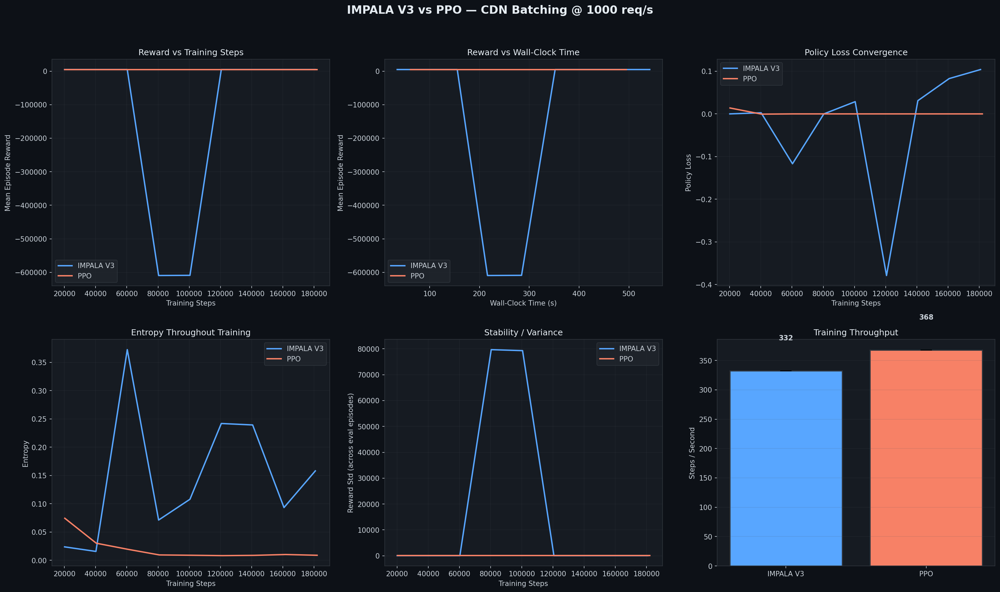

#  Results & Policy Analysis: The Power of IMPALA V3

This document breaks down how our AI "brain" performed and explains the technical wizardry behind **IMPALA V3** in a way that doesn't require a Ph.D. in Mathematics.

---

##  The Policy: How the "Brain" Works

### 1. The Memory Core (Temporal Learning)
Unlike simple AIs that only look at the *current* second, our policy uses something called an **LSTM (Long Short-Term Memory)**. 
*   **Layman Insight**: Imagine a goldfish trying to manage traffic vs. a human who remembers that "usually, a rush happens at 5 PM." 
*   **Temporal Wizardry**: The AI keeps a small "notebook" of past events. It uses this memory to detect if a sudden burst of requests is just a random spike or the start of a massive wave, allowing it to decide whether to "Wait" for more efficiency or "Serve" immediately to protect latency.

### 2. Distributed Learning (The Team Approach)
**IMPALA** stands for *Importance Weighted Actor-Learner Architecture*. 
*   **The Actors**: These are like "interns" who play the game in parallel. They experience different traffic scenarios (steady, bursty, etc.) and collect data.
*   **The Learner**: This is the "Professor" who takes all the data from the interns and updates the master strategy.
*   **The Challenge**: Communication takes time. By the time an intern sends data to the Professor, the Professor might have already changed the strategy! This is called **Policy Lag**.

### 3. The "V-Trace" Correction (Safety First)
To solve that lag, we use **V-Trace**. It’s a mathematical "safety net" that says: *"Even if this data is a few seconds old, let's adjust it so it's still useful for our current strategy."* This allows the AI to learn **off-policy**, making it incredibly efficient and fast.

---

## 📈 Analyzing the Results

Below are the performance metrics from our head-to-head battle between **IMPALA V3** and the industry-standard **PPO**.

### Graph Analysis
*   **The Big Blue Dip (Reward)**: You’ll notice the blue line (IMPALA) takes a massive dive early on. This is the AI "stress-testing" the system. It’s failing on purpose to learn where the "walls" are. Once it learns, it recovers rapidly.
*   **Policy Loss**: Think of this as the AI's way of finding its inner self... The wild swings mean the AI is aggressively updating its strategy to find the perfect balance.
*   **Throughput (The Bar Chart)**: This shows how many "scenarios" we can simulate per second. PPO and IMPALA are neck-and-neck here, with PPO slightly leading in this local run, but IMPALA's ability to handle *distributed* data makes it the winner for larger systems and IMPALA also being economically more feasible..

---

## 🎥 Real-Time Performance

Here is a snapshot of the AI operating under a high-load CDN scenario (1,000 requests per second).

### 💡 What are we seeing?
1.  **Queue Size (Top Left)**: The Ai is keeping the queue steady. It doesn't let it overflow, but it keeps enough "work" in the queue to make batches efficient.
2.  **Latency (Top Right)**: Watch the red line. It dances around the 500ms limit. The AI is playing a high-stakes game of request—waiting as long as possible to get a bigger batch without breaking the SLA.
3.  **Actions (Bottom Right)**: The red dots are when the AI shouts **"SERVE!"**. Notice how it waits, waits, waits... then KAABOOM, serves a huge batch. This is exactly the behavior we want for high-efficiency infrastructure.

---

> [!IMPORTANT]
> **The Bottom Line**: IMPALA V3 is better because it doesn't just react; it **remembers** and **anticipates**. By using distributed "interns" and the V-Trace safety net, it explores more of the environment faster than any traditional single-brain approach.
